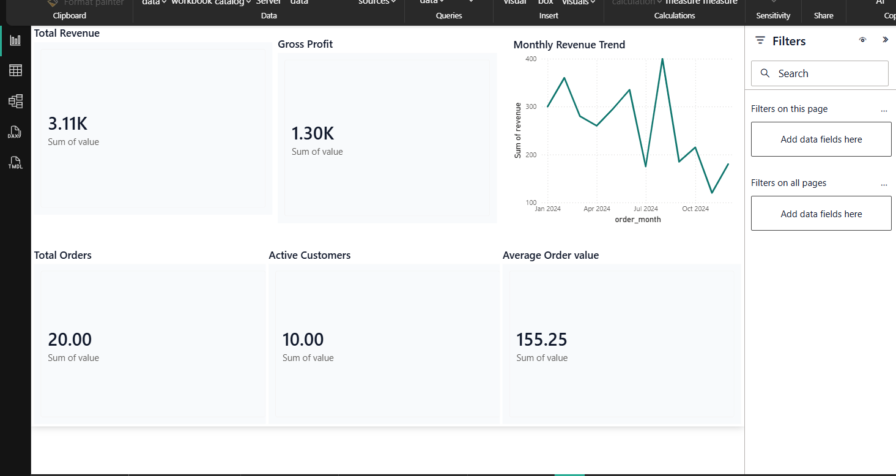
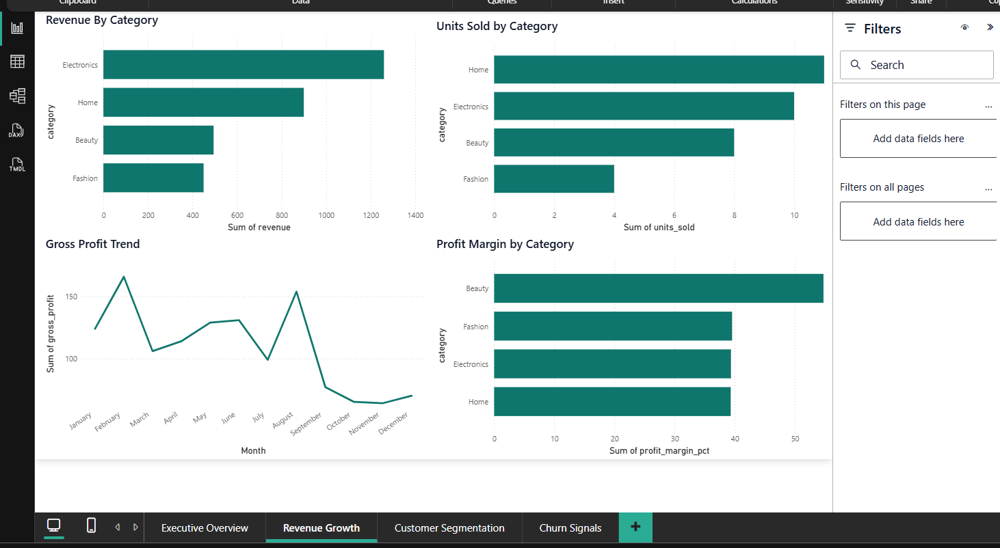
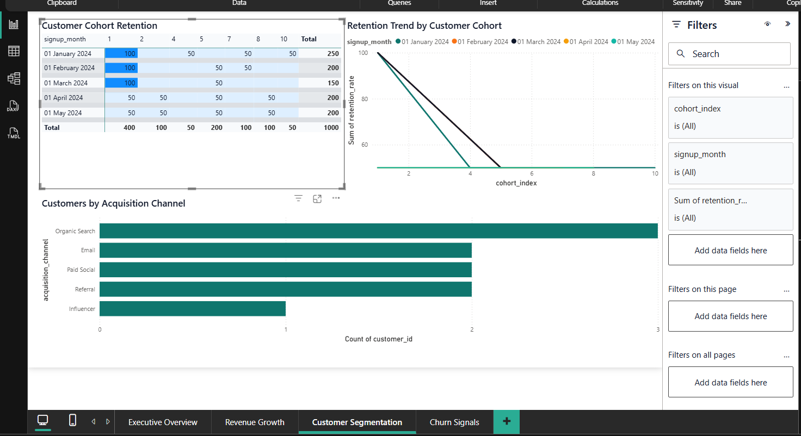
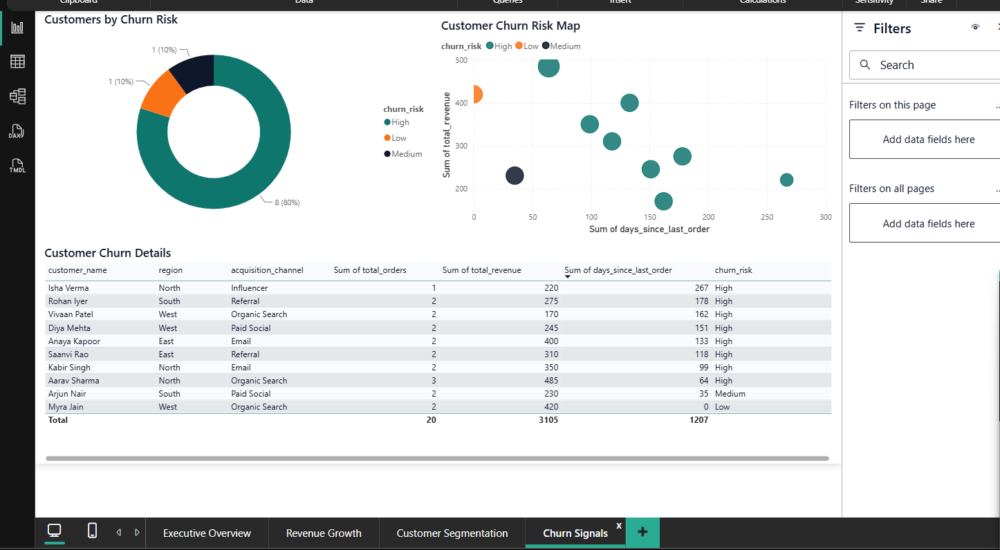
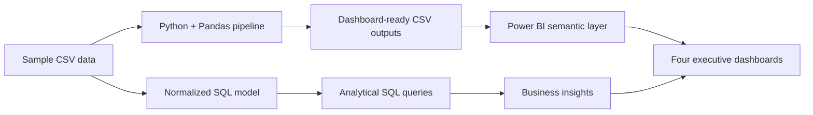
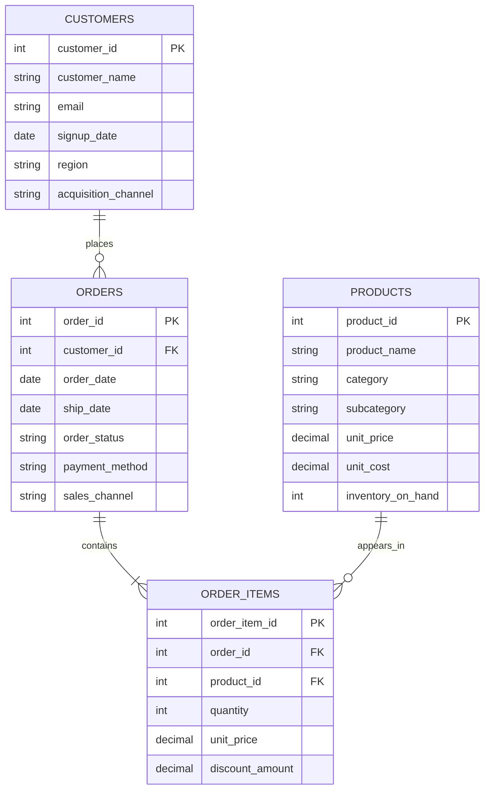

<div align="center">

# Shoplytics

### E-Commerce Analytics Platform

**From raw transactions to executive decisions with SQL, Python, Pandas, and Power BI**

[](sql/02_analytics_queries.sql)
[](src/shoplytics/pipeline.py)
[](src/shoplytics/pipeline.py)
[](powerbi/shoplytics-dashboard.pbix)

[Explore the dashboards](#dashboard-gallery) · [Run the pipeline](#run-locally) · [Download the Power BI report](powerbi/shoplytics-dashboard.pbix)

</div>

---

## Overview

Shoplytics is an end-to-end e-commerce analytics project that turns normalized transaction data into decision-ready business intelligence. The project combines relational data modeling, advanced SQL, a reusable Python/Pandas transformation pipeline, and four interactive Power BI dashboards.

The analysis answers practical retail questions around revenue growth, category performance, customer retention, acquisition effectiveness, churn risk, and inventory planning. The included dataset is fictional and safe to use for demonstrations and portfolio review.

### Project highlights

- Normalized relational schema covering customers, products, orders, and order items.
- SQL analysis for monthly performance, cohort retention, churn risk, profitability, and restocking.
- Reproducible Python/Pandas pipeline producing six Power BI-ready datasets.
- Four executive dashboards designed for fast interpretation by non-technical stakeholders.
- Complete `.pbix` report, dashboard screenshots, Power BI theme, and report specification.

## KPI Snapshot

| Metric | Result |
|---|---:|
| Total revenue | 3,105 |
| Gross profit | 1,299 |
| Total orders | 20 |
| Active customers | 10 |
| Average order value | 155.25 |

> These figures are generated from the included sample dataset by `python run_analysis.py`.

## Dashboard Gallery

### 1. Executive Overview

An at-a-glance summary of revenue, gross profit, order volume, active customers, average order value, and monthly revenue movement.



### 2. Revenue Growth

Category revenue, units sold, monthly gross-profit movement, and category-level profit margins reveal the products and periods driving commercial performance.



### 3. Customer Segmentation

Cohort retention, retention trajectories, and acquisition-channel distribution show how customer behavior changes over time and which channels build the customer base.



### 4. Churn Signals

Risk distribution, recency-versus-revenue positioning, and customer-level drill-downs help decision-makers identify valuable customers requiring retention action.



The interactive report is available in [`powerbi/shoplytics-dashboard.pbix`](powerbi/shoplytics-dashboard.pbix). Open it with Power BI Desktop to explore filters, tooltips, and cross-visual interactions.

## Analytics Workflow



## Data Model

The source model separates business entities to reduce duplication and support reliable analysis.



The SQL DDL is available in [`sql/01_schema.sql`](sql/01_schema.sql).

## Dataset Guide

### Source datasets

| Dataset | Grain | Important fields | Purpose |
|---|---|---|---|
| `customers.csv` | One row per customer | signup date, region, acquisition channel | Customer profile, acquisition, and cohort analysis |
| `products.csv` | One row per product | category, price, cost, inventory | Product hierarchy, margin, and stock analysis |
| `orders.csv` | One row per order | order date, status, payment method, channel | Order timing, channel, and customer activity |
| `order_items.csv` | One row per order line | product, quantity, price, discount | Revenue, unit demand, and profitability calculations |

The sample source files live in [`data/sample`](data/sample).

### Generated analytics datasets

| Output | Grain | Key measures | Power BI use |
|---|---|---|---|
| `kpi_summary.csv` | One row per KPI | revenue, profit, orders, customers, AOV | Executive KPI cards |
| `monthly_revenue.csv` | One row per month | revenue, gross profit, orders, customers, AOV | Monthly growth and profitability trends |
| `category_performance.csv` | One row per category | revenue, profit, units, orders, margin | Category comparison visuals |
| `cohort_retention.csv` | One row per cohort-period | cohort size, active customers, retention rate | Cohort matrix and retention trend |
| `customer_churn_signals.csv` | One row per customer | recency, orders, revenue, risk level | Churn distribution, scatter plot, detail table |
| `restock_recommendations.csv` | One row per recently sold product | inventory, recent units, recent revenue, priority | Inventory monitoring and restocking decisions |

Generated files are written to [`output`](output).

## Business Logic

### Revenue and profitability

- Gross revenue is calculated from quantity multiplied by transaction price.
- Net revenue subtracts line-level discounts.
- Gross profit subtracts product cost from net revenue.
- Average order value divides total net revenue by distinct orders.

### Cohort retention

- Customers are grouped by signup month.
- Each purchase month is converted into a cohort-period index.
- Retention rate measures active customers as a percentage of the original cohort size.

### Churn signals

Customer risk is determined from purchase recency relative to the latest order date in the dataset:

| Days since last order | Risk classification |
|---:|---|
| 0-30 | Low |
| 31-60 | Medium |
| More than 60 | High |

### Restocking signals

The pipeline combines recent 45-day sales activity with inventory on hand. Products are classified as `Critical`, `Monitor`, or `Healthy` to support replenishment prioritization.

## SQL Analysis

[`sql/02_analytics_queries.sql`](sql/02_analytics_queries.sql) contains production-style analytical queries for:

- Monthly revenue, order volume, and active-customer trends.
- Category-level units, revenue, gross profit, and order contribution.
- Signup-month cohort retention using common table expressions.
- Customer churn risk using recency, frequency, and revenue summaries.
- Restocking opportunities using inventory and recent sales velocity.

The queries use SQL Server syntax, including `DATEFROMPARTS`, `DATEDIFF`, and `DATEADD`.

## Python Pipeline

[`src/shoplytics/pipeline.py`](src/shoplytics/pipeline.py) performs the analytical workflow:

1. Loads the four source CSV files.
2. Joins order lines with orders, customers, and products.
3. Calculates gross revenue, net revenue, gross profit, order month, and signup cohort.
4. Aggregates KPI, monthly, category, cohort, churn, and inventory outputs.
5. Exports clean CSV files for Power BI.

## Run Locally

### One-command Windows setup

From PowerShell in the project directory:

```powershell
powershell -ExecutionPolicy Bypass -File .\run_shoplytics.ps1
```

The script checks Python, creates or reuses a virtual environment when possible, installs missing dependencies, runs the pipeline, and writes the generated datasets to `output/`.

### Manual setup

```powershell
python -m venv .venv
.\.venv\Scripts\Activate.ps1
python -m pip install -r requirements.txt
python run_analysis.py
```

Expected completion message:

```text
Dashboard-ready datasets exported to ...\Shoplytics\output
```

## Power BI Report

1. Run the pipeline to refresh the files in `output/`.
2. Open [`powerbi/shoplytics-dashboard.pbix`](powerbi/shoplytics-dashboard.pbix) with Power BI Desktop.
3. If prompted, update the CSV source paths to the local `output` directory.
4. Select `Home` → `Refresh`.
5. Optionally import [`powerbi/shoplytics_theme.json`](powerbi/shoplytics_theme.json) from `View` → `Browse for themes`.

The dashboard layout and visual mapping are documented in [`powerbi/dashboard_spec.md`](powerbi/dashboard_spec.md).

## Repository Structure

```text
Shoplytics/
├── data/sample/                 # Fictional source datasets
├── output/                      # Generated Power BI-ready datasets
├── powerbi/
│   ├── screenshots/             # Dashboard previews used in this README
│   ├── dashboard_spec.md        # Report design and visual mapping
│   ├── shoplytics-dashboard.pbix # Interactive Power BI report
│   └── shoplytics_theme.json    # Power BI color and typography theme
├── sql/
│   ├── 01_schema.sql            # Normalized relational schema
│   └── 02_analytics_queries.sql # Business analysis queries
├── src/shoplytics/
│   └── pipeline.py              # Pandas transformation pipeline
├── requirements.txt
├── run_analysis.py
└── run_shoplytics.ps1
```

## Key Findings from the Sample Data

- Electronics generated the highest category revenue at `1,260`.
- Beauty produced the strongest gross margin at `54.75%`.
- Organic Search acquired the largest number of customers.
- Eight of ten customers are flagged as high risk under the recency rules, highlighting a significant retention opportunity.
- Monthly revenue peaked in August in the included sample period.

## Possible Extensions

- Connect the model to SQL Server or PostgreSQL instead of local CSV files.
- Add scheduled refresh through Power BI Service.
- Introduce customer lifetime value and RFM segmentation.
- Add demand forecasting and inventory coverage metrics.
- Build automated data-quality checks and pipeline tests.

---

<div align="center">

Built as a complete analytics portfolio project: **model → query → transform → visualize → decide**.

</div>
